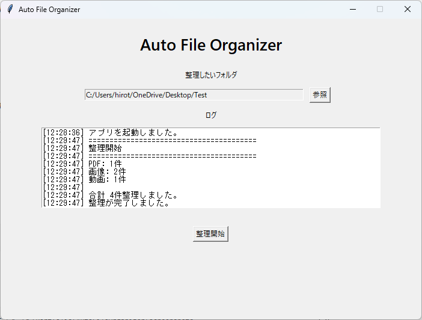

# 📁 Auto File Organizer

Pythonで開発したファイル整理デスクトップアプリです。

指定したフォルダ内のファイルを拡張子ごとに自動で分類し、整理できます。

---

## 📸 スクリーンショット



---

## ✨ 主な機能

- 📂 フォルダ選択
- 🚀 ワンクリックで整理開始
- 🖼️ 画像・PDF・動画・音楽・Word・Excelを自動分類
- 📝 ログ表示
- 📊 整理件数表示

---

## 🛠 使用技術

- Python
- Tkinter
- pathlib
- shutil
- Git
- GitHub

---

## 📁 整理例

### 整理前

```text
Downloads/
├── cat.jpg
├── dog.png
├── report.pdf
├── movie.mp4
├── music.mp3
```

### 整理後

```text
Downloads/
├── 画像/
│   ├── cat.jpg
│   └── dog.png
├── PDF/
│   └── report.pdf
├── 動画/
│   └── movie.mp4
├── 音楽/
│   └── music.mp3
```

---

## ▶️ 実行方法

```bash
git clone https://github.com/hirotobasketball6-ctrl/AutoFileOrganizer.git

cd AutoFileOrganizer

pip install -r requirements.txt

python main.py
```

---

## 🚀 今後追加予定

- [ ] 同名ファイルの自動リネーム
- [ ] 進捗バー
- [ ] ドラッグ＆ドロップ対応
- [ ] ダークモード
- [ ] `.exe`化

---

## 📄 ライセンス

MIT License
